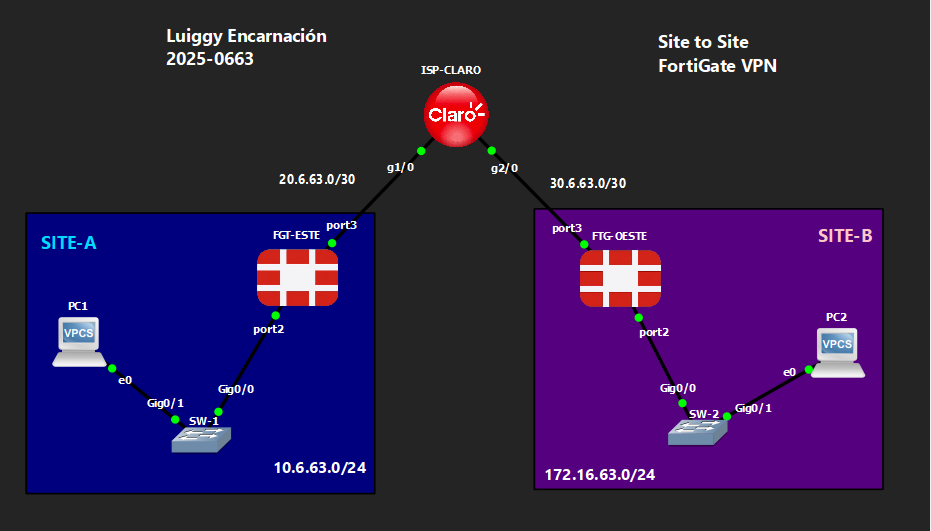

# 🔒 VPN Site-to-Site FortiGate — IPSec IKEv2

**Luiggy Habraham Encarnación Cabrera · Matrícula 2025-0663**


> VPN Site-to-Site IPSec (IKEv2) entre dos FortiGate, primer laboratorio de la serie sobre una plataforma distinta a Cisco IOS: el túnel es siempre route-based en FortiGate, con Phase 1, Phase 2, ruta estática y políticas de firewall como cuatro piezas independientes.

---

## 📑 Tabla de Contenido

1. [Objetivo del Laboratorio](#-objetivo-del-laboratorio)
2. [Parámetros Usados](#-parámetros-usados)
3. [Documentación de la Red](#️-documentación-de-la-red)
4. [Las 4 Piezas de un Túnel IPSec en FortiGate](#-las-4-piezas-de-un-túnel-ipsec-en-fortigate)
5. [Funcionamiento de la VPN](#-funcionamiento-de-la-vpn)
6. [Configuración](#-configuración)
7. [Verificación](#-verificación)
8. [Capturas de Pantalla](#-capturas-de-pantalla)
9. [Video de Demostración](#-video-de-demostración)

---

## 🎯 Objetivo del Laboratorio

Establecer una VPN **Site-to-Site IPSec con IKEv2** entre dos firewalls **FortiGate** (FGT-ESTE y FGT-OESTE), conectando las LANs de SITE-A (10.6.63.0/24) y SITE-B (172.16.63.0/24) a través de un ISP simulado (router Cisco IOS, ISP-CLARO). El objetivo es comparar el modelo de configuración de FortiOS frente a Cisco IOS: en lugar de un único bloque `crypto`, FortiGate exige configurar por separado la Phase 1, la Phase 2, una ruta estática hacia la interfaz virtual del túnel y políticas de firewall explícitas en ambos sentidos, ya que FortiGate deniega todo el tráfico por defecto.

---

## 🧩 Parámetros Usados

| Parámetro | Valor |
|---|---|
| Plataforma VPN | FortiGate / FortiOS 7.0.3 (build 0237) |
| Versión IKE | IKEv2 |
| Proposal (Phase 1 y Phase 2) | des-sha256 |
| Grupo Diffie-Hellman | 14 |
| Peer type | `any` (acepta cualquier identidad de peer) |
| Remote gateway | IP pública fija del FortiGate remoto |
| DPD (Dead Peer Detection) | `on-idle` |
| Net-device | disable |
| Auto-negotiate (Phase 2) | enable |
| Selectores de tráfico (Phase 2) | Subredes estáticas (src-subnet / dst-subnet) |
| Modelo de túnel | Route-based (interfaz de túnel virtual dedicada) |
| Enrutamiento | Ruta estática por sitio hacia la interfaz de túnel |
| Políticas de firewall | 3 por sitio: LAN→Internet (NAT), LAN→VPN, VPN→LAN (sin NAT) |

---

## 🗺️ Documentación de la Red

### Topología



### Tabla de Direccionamiento

| Dispositivo | Interfaz | IP | Rol |
|---|---|---|---|
| ISP-CLARO | g1/0 | 20.6.63.2/30 | Enlace hacia FGT-ESTE |
| ISP-CLARO | g2/0 | 30.6.63.2/30 | Enlace hacia FGT-OESTE |
| ISP-CLARO | Lo0 | 20.20.20.20/32 | Loopback de pruebas |
| FGT-ESTE | port3 (WAN) | 20.6.63.1/30 | Hacia ISP-CLARO |
| FGT-ESTE | port2 (LAN) | 10.6.63.1/24 | SITE-A (objeto `LAN_SITEA`) |
| FGT-ESTE | port1 | DHCP | Interfaz de gestión/uplink adicional |
| FGT-ESTE | SITEA-TO-SITEB | Túnel virtual | Interfaz IPSec route-based (sobre port3) |
| FGT-OESTE | port3 (WAN) | 30.6.63.1/30 | Hacia ISP-CLARO |
| FGT-OESTE | port2 (LAN) | 172.16.63.1/24 | SITE-B (objeto `LAN_SITEB`) |
| FGT-OESTE | port1 | DHCP | Interfaz de gestión/uplink adicional |
| FGT-OESTE | SITEB-TO-SITEA | Túnel virtual | Interfaz IPSec route-based (sobre port3) |
| SW-1 | VLAN 1 | 10.6.63.2/24 | Gateway 10.6.63.1 (SITE-A) |
| SW-2 | VLAN 1 | 172.16.63.2/24 | Gateway 172.16.63.1 (SITE-B) |

### Detalles del Entorno

| Parámetro | Valor |
|---|---|
| Emulador | GNS3 / Packet Tracer |
| Firewalls | 2x FortiGate-VM64-KVM, FortiOS 7.0.3 build 0237 |
| Router ISP | Cisco IOS (ISP-CLARO) |
| Sitios | SITE-A (10.6.63.0/24), SITE-B (172.16.63.0/24) |
| Objetos de dirección | `LAN_SITEA` (10.6.63.0/24), `LAN_SITEB` (172.16.63.0/24) |

---

## 🧱 Las 4 Piezas de un Túnel IPSec en FortiGate

A diferencia de Cisco IOS, donde toda la VPN se concentra en un bloque `crypto`, en FortiGate el túnel se arma con **cuatro configuraciones independientes**, y omitir cualquiera de ellas deja el túnel sin funcionar aunque la Fase 1 y Fase 2 estén correctas:

1. **Phase 1** (`config vpn ipsec phase1-interface`): el canal IKE — remote gateway, PSK, proposal, versión IKE.
2. **Phase 2** (`config vpn ipsec phase2-interface`): los selectores de tráfico (subredes local/remota) y la SA de datos.
3. **Ruta estática** (`config router static`): dirige el tráfico hacia la interfaz de túnel virtual creada automáticamente al definir la Phase 1.
4. **Políticas de firewall** (`config firewall policy`): permiten explícitamente el tráfico en ambos sentidos — FortiGate deniega todo por defecto, incluso con el túnel ya levantado.

---

## 🔬 Funcionamiento de la VPN

**Phase 1 (IKEv2):**
- `set ike-version 2`, `set proposal des-sha256`, `set dhgrp 14`.
- `set remote-gw` apunta a la IP pública fija del FortiGate remoto (aunque `set peertype any` está configurado, el gateway remoto ya es estático, por lo que en la práctica el túnel se comporta como un peer fijo, no como un dial-up).
- `set dpd on-idle`: envía keepalives solo cuando el enlace está inactivo, para detectar caídas del peer sin generar tráfico innecesario.
- Al crear la Phase 1 con nombre (`SITEA-TO-SITEB` / `SITEB-TO-SITEA`), FortiOS genera automáticamente una **interfaz de túnel virtual** con ese mismo nombre — este es el motivo por el que en FortiGate todo túnel IPSec es, en esencia, route-based.

**Phase 2:**
- Mismo proposal y grupo DH que la Phase 1.
- `set src-subnet` / `set dst-subnet` definen los selectores de tráfico de forma estática (LAN local ↔ LAN remota).
- `set auto-negotiate enable` permite que el túnel se levante proactivamente sin esperar tráfico interesante.

**Ruta estática:**
- Cada FortiGate tiene una ruta estática cuyo `device` es la interfaz de túnel (no una IP de next-hop), apuntando a la subred de la LAN remota.

**Políticas de firewall (3 por sitio):**
- `PERMIT LAN-TO-INTERNET`: LAN local → `all`, con NAT habilitado (salida a Internet).
- `PERMIT LAN-TO-VPN`: LAN local → LAN remota, a través de la interfaz de túnel, **sin NAT** (debe preservarse la IP origen para que el tráfico regrese correctamente).
- `PERMIT VPN-TO-LAN`: tráfico entrante desde la interfaz de túnel hacia la LAN local, también sin NAT.

---

## 🔧 Configuración

- `files/config.txt` (ISP-CLARO, notas de interfaz FTG, SW-1, SW-2)
- `files/FTG-ESTE_7-0_0237_Site-to-Site.conf` (Backup FTG-ESTE)
- `files/FTG-OESTE_7-0_0237_Site-to-Site.conf` (Backup FTG-OESTE)

Bloques relevantes de FortiOS (FGT-ESTE):

```
config vpn ipsec phase1-interface
    edit "SITEA-TO-SITEB"
        set interface "port3"
        set ike-version 2
        set peertype any
        set net-device disable
        set proposal des-sha256
        set dpd on-idle
        set dhgrp 14
        set remote-gw 30.6.63.1
        set psksecret ENC <clave-cifrada>
    next
end

config vpn ipsec phase2-interface
    edit "SITEA-TO-SITEB"
        set phase1name "SITEA-TO-SITEB"
        set proposal des-sha256
        set dhgrp 14
        set auto-negotiate enable
        set src-subnet 10.6.63.0 255.255.255.0
        set dst-subnet 172.16.63.0 255.255.255.0
    next
end

config router static
    edit 2
        set dst 172.16.63.0 255.255.255.0
        set device "SITEA-TO-SITEB"
    next
end

config firewall policy
    edit 2
        set name "PERMIT LAN-TO-VPN"
        set srcintf "port2"
        set dstintf "SITEA-TO-SITEB"
        set srcaddr "LAN_SITEA"
        set dstaddr "LAN_SITEB"
        set action accept
        set service "ALL"
    next
end
```

FGT-OESTE es simétrico, cambiando `SITEA-TO-SITEB` por `SITEB-TO-SITEA`, `remote-gw 20.6.63.1` y las subredes/objetos invertidos.

---

## ✅ Verificación

```
diagnose vpn ike gateway list
diagnose vpn tunnel list
get vpn ipsec tunnel summary
get router info routing-table static
```

Se espera:
- `diagnose vpn ike gateway list` → SA de Fase 1 establecida con el peer remoto.
- `get vpn ipsec tunnel summary` → túnel en estado **selectors(total,up)=1/1**.
- `get router info routing-table static` → ruta hacia la LAN remota vía la interfaz de túnel.
- Ping extendido entre PC1 (SITE-A) y PC2 (SITE-B) exitoso.

---

## 📸 Capturas de Pantalla

```
images/
├── 01_topologia.png
├── 02_fgt-este_tunnel_config.png
├── 03_fgt-este_interfaces.png
├── 04_fgt-este_static_route.png
├── 05_fgt-este_firewall_policy.png
├── 06_fgt-tunnel_config.png
├── 07_fgt-oeste_interfaces.png
├── 08_fgt-oeste_static_route.png
├── 09_fgt-oeste_firewall_policy.png
├── 10_ping_tracert.png
└── 11_wireshark_esp_trafico.png
```

---

## 🎬 Video de Demostración

> 📺 **[Ver demostración en YouTube →](https://youtu.be/ROcTF2zv1cM)**
